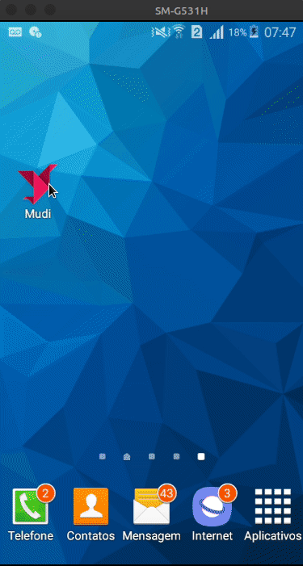

<p align="center">
  
</p>

# Mudi Saúde 🩺
Esta pasta é referente ao Frontend Mobile do desafio proposto no processo de seleção da empresa Mudi.

# Proposta 🔥
Este projeto é uma intervenção tecnológica na área da saúde, permitindo que pacientes se conectem de forma mais eficiente com
os médicos, a fim de agilizar o sistema de saúde Brasileiro na medida do possível.<br />
Esse projeto Mobile consiste no app voltado para o paciente, o qual terá acesso a uma lista de médicos, de diversas especialidades, 
todos disponíveis para agendar uma consulta, de acordo com data e hora.
<br />
<code>Obs: como foi solicitado, todos os dados estão estáticos, sem nenhuma integração com o backend.</code> <br />

# Resultado 🚀
<p align="center">
  
</p>

# Tecnologias Utilizadas 🚀
Typescript 🦕 </br>
React ⚛️ <br />
React Native ⚛️ <br />
React Navigation ⚛️ <br />
Styled-Components 💅 <br />
React Native Vector Icons ⚛️❤️ <br />
Polished 🌈 <br />
Entre outras...

# Estrutura de Pastas 🗃️

    ├── src                # Arquivos principais
        ├── assets         # Arquivos de mídia (fotos)
        ├── components     # Componentes Isolados
        ├── pages          # Páginas da aplicação
        ├── App.tsx        # Arquivo principal do app
        └── routes.tsx     # Rotas construídas com React Navigation
Todo componente (indicado por uma pasta) está dividido em <code>index.tsx</code> e <code>styles.ts</code>, isolando lógica e estrutura, e
estilização, respectivamente. <br />
Exemplo:

        ├── "componente"
            ├── index.tsx        
            └── styles.ts

# Como obter esse repositório 🤔
- Mobile:
  1. Navegue até a pasta mobile.
  2. Rode o comando <code> yarn </code> na raíz da pasta para baixar as dependências.
  3. Rode o comando <code> yarn android</code> (se estiver emulando em um android) ou <code>yarn ios</code> (se estiver emulando em um ios) na raíz da pasta do projeto clonado para instalar o app no emulador.
  4. Rode <code> yarn start </code> na raíz da pasta do projeto para inicializar o Metro Bundler.
  5. Abra o projeto no seu emulador.
  6. Happy Hacking! 🚀

# Como Contribuir? 😍
**Faça um fork deste repositório**

```bash
# Clone o seu fork
$ git clone url-do-seu-fork && cd DesafioMudi

# Crie uma branch com sua feature ou correção de bugs
$ git checkout -b minha-branch

# Faça o commit das suas alterações
$ git commit -m 'minhas alterações'

# Faça o push para a sua branch
$ git push origin minha-branch
```

Delete sua branch, se quiser, quando o merge da sua pull request for feito. <br />

Feito com 💜 por <a href="https://www.linkedin.com/in/andrecampll/" target="blank">andrecampll</a>.
