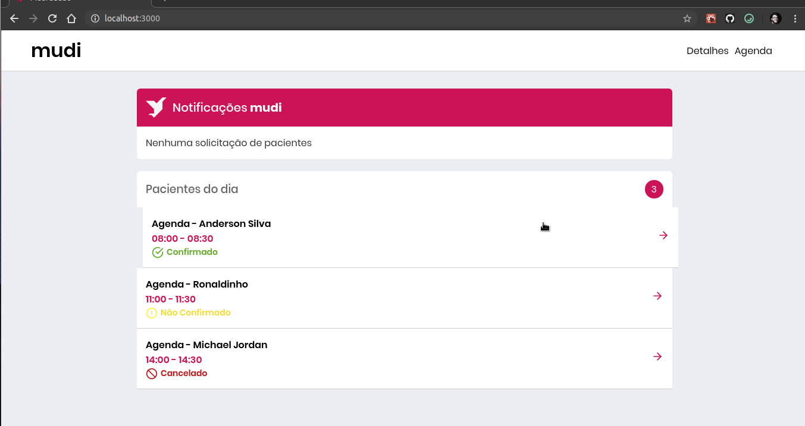

<p align="center">
  
</p>

# Mudi Saúde 🩺
Esta pasta é referente ao Frontend Web do desafio proposto no processo de seleção da empresa Mudi.

# Proposta 🔥
Este projeto é uma intervenção tecnológica na área da saúde, permitindo que pacientes se conectem de forma mais eficiente com
os médicos, a fim de agilizar o sistema de saúde Brasileiro na medida do possível.<br />
Esse Frontend Web consiste na agenda virtual do médico, a qual fornecerá dados sobre os agendamentos, tais como nome do paciente e horário da consulta. <br />
<code>Obs: como foi solicitado, todos os dados estão estáticos, sem nenhuma integração com o backend.</code> <br />
Live demo: https://frontendteste.herokuapp.com/ (O carregamento pode demorar um pouco)

# Tecnologias Utilizadas 🚀
Typescript 🦕 </br>
React ⚛️ <br />
Styled-Components 💅 <br />
React Icons ⚛️❤️ <br />
Polished 🌈 <br />
Entre outras...

# Resultado 🚀
<p align="center">
  
</p>

# Estrutura de Pastas 🗃️

    ├── src                # Arquivos principais
        ├── assets         # Arquivos de mídia (fotos)
        ├── components     # Componentes Isolados
        ├── pages          # Páginas da aplicação
        ├── styles         # Estilos globais
        └── routes         # Rotas construídas com react router dom
Todo componente (indicado por uma pasta) está dividido em <code>index.tsx</code> e <code>styles.ts</code>, isolando lógica e estrutura, e
estilização, respectivamente. <br />
Exemplo:

        ├── "componente"
            ├── index.tsx        
            └── styles.ts

# Testes 🧪
Todos os testes dessa aplicação foram desenvolvidos com Jest e utilizam dados fakes. <br />
Para rodar todos os testes use <code> yarn test </code>.

# Como obter esse repositório? 🤔
- Frontend:
  1. Clone esse repositório utilizando <code>git clone</code>.
  2. Navegue até a pasta 'web'.
  3. Rode o comando <code> yarn </code> na raíz da pasta para baixar as dependências.
  4. Rode o comando <code> yarn start</code> para inicializar a aplicação em <code>localhost:3000</code>.
  5. Happy Hacking! 🚀

# Como Contribuir? 😍
**Faça um fork deste repositório**

```bash
# Clone o seu fork
$ git clone url-do-seu-fork && cd DesafioMudi

# Crie uma branch com sua feature ou correção de bugs
$ git checkout -b minha-branch

# Faça o commit das suas alterações
$ git commit -m 'minhas alterações'

# Faça o push para a sua branch
$ git push origin minha-branch
```

Delete sua branch, se quiser, quando o merge da sua pull request for feito. <br />

Feito com 💜 por <a href="https://www.linkedin.com/in/andrecampll/" target="blank">andrecampll</a>.
